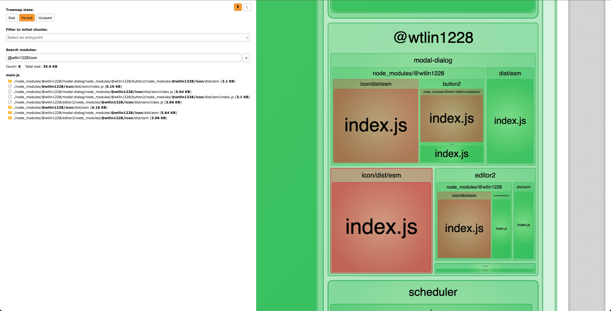
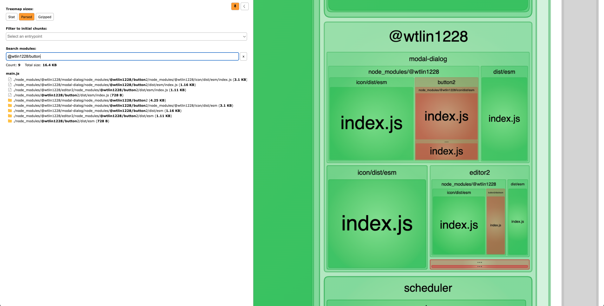

### Problem

In order to test the duplications in webpack bundle. The `app` has project dependency graph like this:

`$ yarn list --pattern @wtlin1228`

```
.
├── @wtlin1228/editor2 1.0.0
│   └── @wtlin1228/button2 1.3.0 (duplicate)
│       └── @wtlin1228/icon 1.1.1 (duplicate)
├── @wtlin1228/modal-dialog 1.0.0
│   ├── @wtlin1228/button2 1.3.0 (duplicate)
│   │   └── @wtlin1228/icon 1.1.1 (duplicate)
│   └── @wtlin1228/icon 2.0.0
├── @wtlin1228/button2 2.5.0
└── @wtlin1228/icon 3.0.0
```

Then we will find there are 4 `@wtlin1228/icon` and 3 `@wtlin1228/button` inside our webpack bundle. Which could be reduced to 3 and 2 for each.





### Reproduce Steps

Reproduce steps:

1. `$ cd app`
2. `$ yarn`
3. `$ yarn build`
4. open browser with `http://127.0.0.1:8888/`

### Webpack Plugins trying to solve this problem

- https://github.com/atlassian-labs/webpack-deduplication-plugin
- https://github.com/FormidableLabs/inspectpack/#fixing-bundle-duplicates
- https://github.com/darrenscerri/duplicate-package-checker-webpack-plugin
- https://github.com/zillow/webpack-stats-duplicates
- https://github.com/team-griffin/webpack-dedupe-plugin

### Blog Post

- https://www.developerway.com/posts/webpack-and-yarn-magic-against-duplicates-in-bundles
